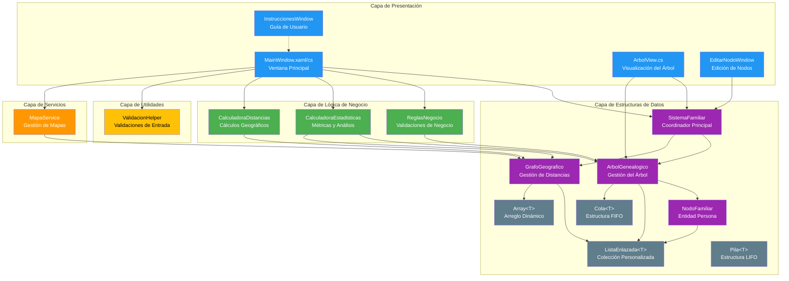

# Diagrama de Arquitectura

## Descripción General

La aplicación **Árbol Genealógico** sigue una arquitectura en capas con separación de responsabilidades, diseñada para gestionar árboles genealógicos con visualización gráfica y análisis geográfico de distancias entre familiares.

## Diagrama de Arquitectura por Capas



## Descripción de las Capas

### 🎨 **Capa de Presentación (UI)**
**Tecnología:** WPF (Windows Presentation Foundation) con XAML

**Responsabilidad:** Gestionar la interacción con el usuario y la visualización de datos.

**Componentes:**
- **MainWindow:** Ventana principal que coordina todas las pestañas y operaciones
- **ArbolView:** Canvas personalizado para dibujar el árbol genealógico de forma recursiva
- **EditarNodoWindow:** Ventana modal para editar información de miembros existentes
- **InstruccionesWindow:** Guía interactiva de uso de la aplicación

**Características:**
- Diseño dark mode moderno
- Navegación por pestañas (Agregar, Árbol, Estadísticas, Mapa, Agregar Padres)
- Visualización gráfica con conexiones jerárquicas y de cónyuges

---

### 💼 **Capa de Lógica de Negocio**
**Responsabilidad:** Implementar las reglas de negocio y validaciones complejas.

**Componentes:**
- **ReglasNegocio:** 
  - Validación de diferencia de edad mínima (10 años entre padres e hijos)
  - Validación de fechas de nacimiento coherentes
  - Reglas de jerarquía familiar
  
- **CalculadoraEstadisticas:**
  - Total de miembros en el árbol
  - Conteo de generaciones
  - Análisis de distancias promedio, máximas y mínimas
  
- **CalculadoraDistancias:**
  - Cálculo de distancias geográficas usando fórmula de Haversine
  - Conversión de coordenadas a distancias reales en km

---

### 🛠️ **Capa de Servicios**
**Responsabilidad:** Proporcionar servicios transversales a la aplicación.

**Componentes:**
- **MapaService:**
  - Integración con SkiaSharp para renderizado de mapas
  - Visualización de ubicaciones geográficas
  - Dibujo de marcadores y etiquetas en el mapa

---

### 📊 **Capa de Estructuras de Datos**
**Responsabilidad:** Implementar estructuras de datos personalizadas y gestionar el modelo de dominio.

**Componentes principales:**

#### **SistemaFamiliar**
- Coordinador principal que integra el árbol genealógico y el grafo geográfico
- Sincroniza operaciones entre ambas estructuras
- Punto único de acceso para la capa de presentación

#### **ArbolGenealogico**
- Implementa un árbol N-ario con raíz única
- Gestiona relaciones padre-hijo
- Operaciones: agregar, eliminar, buscar (por nombre/cédula), obtener todos los nodos
- Sincronización automática de cónyuges y sus hijos
- Navegación BFS (Breadth-First Search) para obtener todos los nodos

#### **GrafoGeografico**
- Grafo no dirigido ponderado
- Almacena coordenadas geográficas (latitud, longitud)
- Gestiona distancias entre nodos
- Recalcula distancias automáticamente al agregar nuevos nodos

#### **NodoFamiliar**
- Entidad central que representa a una persona
- **Atributos:** Nombre, Cédula, Fecha de Nacimiento, Edad, Teléfono, País, Ciudad, Dirección, Coordenadas, Foto
- **Relaciones:** 
  - Lista de padres (máximo 2)
  - Lista de hijos (sin límite)
  - Cónyuge (máximo 1)
- **Métodos:** AgregarHijo(), AgregarPadre(), EstablecerConyuge()

#### **Estructuras de Datos Genéricas**
- **ListaEnlazada\<T\>:** Lista doblemente enlazada personalizada
- **Cola\<T\>:** Cola FIFO para recorridos BFS
- **Pila\<T\>:** Pila LIFO para operaciones específicas
- **Array\<T\>:** Arreglo dinámico con capacidad ajustable

---

### 🔧 **Capa de Utilidades**
**Responsabilidad:** Funciones auxiliares de validación y formateo.

**Componentes:**
- **ValidacionHelper:**
  - Validación de campos obligatorios
  - Validación de formato de cédula
  - Validación de formato de fechas
  - Validación de coordenadas geográficas

---

## Flujo de Datos Principal

### 1. **Agregar un Miembro**
```
Usuario (MainWindow) 
    → ValidacionHelper (validar entrada)
    → ReglasNegocio (validar reglas de negocio)
    → SistemaFamiliar (coordinar operación)
    → ArbolGenealogico (agregar al árbol)
    → GrafoGeografico (agregar ubicación)
    → ArbolView (visualizar)
```

### 2. **Calcular Distancias**
```
Usuario selecciona nodo (MainWindow)
    → CalculadoraDistancias (calcular distancias)
    → GrafoGeografico (obtener coordenadas)
    → Fórmula de Haversine (cálculo)
    → MainWindow (mostrar resultados)
```

### 3. **Eliminar con Descendencia**
```
Usuario (MainWindow)
    → ReglasNegocio (verificar si es cónyuge o jerárquico)
    → ArbolGenealogico (recolectar descendientes y eliminar)
    → GrafoGeografico (eliminar nodos del grafo)
    → ArbolView (redibujar árbol)
```

### 4. **Agregar Segundo Padre**
```
Usuario (MainWindow - Pestaña "Agregar Padres/Madres")
    → SistemaFamiliar.AgregarPadreAMiembro()
    → ArbolGenealogico.AgregarPadreAMiembro()
    → Establecer relación padre-hijo
    → EstablecerConyugesYSincronizarHijos() (automático)
    → Sincronizar hijos de ambos padres
    → ArbolView (redibujar con ambos padres)
```

---

## Patrones de Diseño Utilizados

### 1. **Layered Architecture (Arquitectura en Capas)**
- Separación clara entre presentación, lógica de negocio, y datos
- Cada capa tiene responsabilidades bien definidas

### 2. **Facade Pattern (Patrón Fachada)**
- `SistemaFamiliar` actúa como fachada que simplifica el acceso a `ArbolGenealogico` y `GrafoGeografico`

### 3. **Composite Pattern (Patrón Compuesto)**
- `NodoFamiliar` con colecciones de hijos permite construir estructuras jerárquicas complejas

### 4. **Observer Pattern (Patrón Observador)**
- Eventos en WPF para actualizar la UI cuando cambian los datos

### 5. **Strategy Pattern (Patrón Estrategia)**
- Diferentes algoritmos de dibujo según tipo de nodo (raíz, cónyuge, hijo, hermano)

---

## Tecnologías y Librerías

| Componente | Tecnología |
|-----------|-----------|
| Framework UI | WPF (.NET 8.0) |
| Lenguaje | C# 12 |
| Renderizado Gráfico | Canvas (WPF), SkiaSharp |
| Estructuras de Datos | Implementaciones personalizadas (no se usan colecciones de .NET) |
| Cálculos Geográficos | Fórmula de Haversine |
| Persistencia | Próximamente (JSON/XML) |

---

## Ventajas de esta Arquitectura

✅ **Mantenibilidad:** Código organizado en capas facilita el mantenimiento  
✅ **Escalabilidad:** Fácil agregar nuevas funcionalidades sin afectar otras capas  
✅ **Testabilidad:** Cada capa puede probarse de forma independiente  
✅ **Reutilización:** Estructuras de datos genéricas reutilizables  
✅ **Separación de Responsabilidades:** Cada clase tiene un propósito único y claro  

---

## Próximas Mejoras

🔜 **Persistencia:** Guardar y cargar árboles desde archivo  
🔜 **Búsqueda Avanzada:** Filtros por generación, ubicación, edad  
🔜 **Exportación:** PDF, imagen del árbol  
🔜 **Estadísticas Avanzadas:** Árbol más antiguo, ciudad más frecuente  
