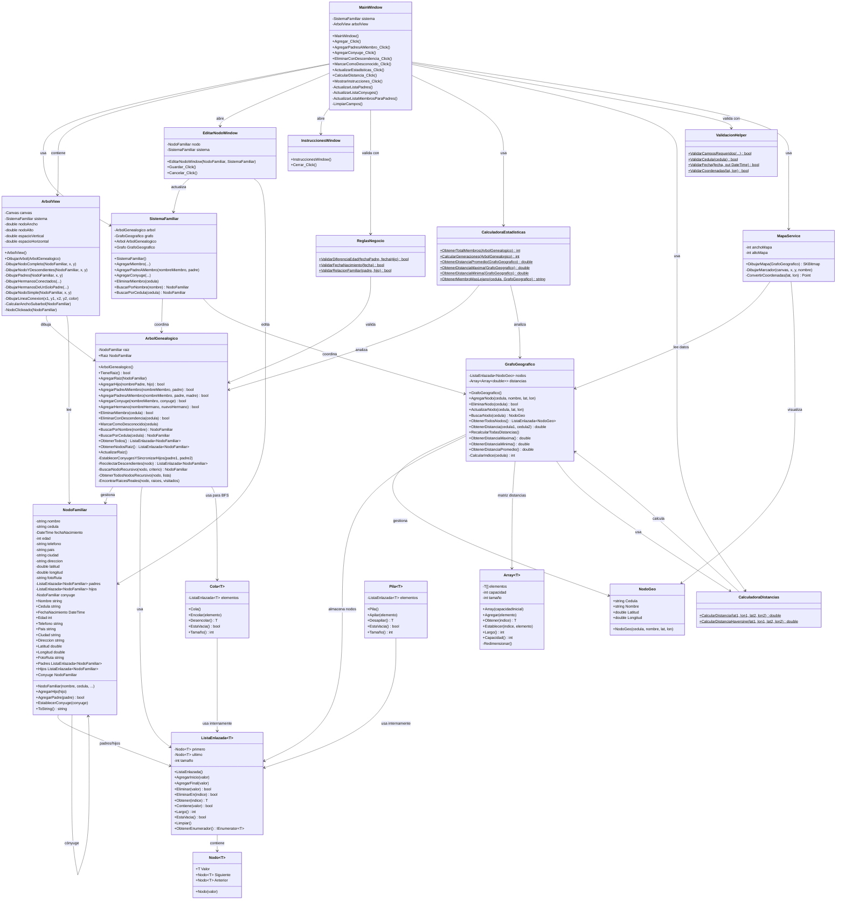
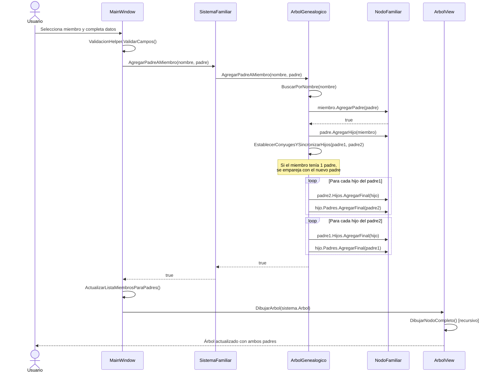

# Diagrama de Clases

## Descripción General

El diagrama de clases muestra la estructura de clases del sistema de Árbol Genealógico, sus relaciones, atributos y métodos principales.

## Diagrama UML Completo



## Descripción de las Clases Principales

### 🎨 **Capa de Presentación**

#### **MainWindow**
**Responsabilidad:** Ventana principal que coordina todas las funcionalidades de la aplicación.

**Atributos clave:**
- `sistema`: Instancia de `SistemaFamiliar` para gestionar datos
- `arbolView`: Componente de visualización del árbol

**Métodos principales:**
- `Agregar_Click()`: Agregar nuevo miembro al árbol
- `AgregarPadresAMiembro_Click()`: Agregar segundo padre a un miembro existente
- `EliminarConDescendencia_Click()`: Eliminar nodo con todos sus descendientes
- `CalcularDistancia_Click()`: Calcular distancias geográficas

---

#### **ArbolView**
**Responsabilidad:** Renderizar visualmente el árbol genealógico en un Canvas.

**Características:**
- Dibujo recursivo de nodos y conexiones
- Manejo de posicionamiento horizontal (evitar solapamiento)
- Visualización de relaciones: padre-hijo (vertical), cónyuge (horizontal), hermanos (agrupados)
- Detección de clics en nodos

**Métodos de dibujo:**
- `DibujarNodoCompleto()`: Dibuja un nodo con su cónyuge si lo tiene
- `DibujarPadres()`: Dibuja padres arriba del nodo (soporta 1 o 2 padres)
- `DibujarHermanosConectados()`: Dibuja hermanos cuando hay 2 padres
- `DibujarHermanosDeUnSoloPadre()`: Dibuja hermanos cuando hay 1 solo padre

---

### 💼 **Capa de Lógica de Negocio**

#### **ReglasNegocio**
**Responsabilidad:** Validar reglas de negocio del dominio familiar.

**Reglas implementadas:**
- Diferencia mínima de edad entre padre e hijo: 10 años
- Fechas de nacimiento válidas (no futuras)
- Coherencia en relaciones familiares

---

#### **CalculadoraEstadisticas**
**Responsabilidad:** Calcular métricas y estadísticas del árbol.

**Estadísticas:**
- Total de miembros
- Número de generaciones
- Distancias: promedio, máxima, mínima
- Miembro más lejano desde un punto de referencia

---

#### **CalculadoraDistancias**
**Responsabilidad:** Calcular distancias geográficas reales.

**Método principal:**
- `CalcularDistanciaHaversine()`: Fórmula matemática para calcular distancia entre dos puntos en la Tierra usando coordenadas (lat/lon)

---

### 🛠️ **Capa de Servicios**

#### **MapaService**
**Responsabilidad:** Generar visualización de mapa con ubicaciones de familiares.

**Funcionalidades:**
- Renderizado de mapa base usando SkiaSharp
- Conversión de coordenadas geográficas a píxeles
- Dibujo de marcadores y etiquetas

---

### 📊 **Capa de Estructuras de Datos**

#### **SistemaFamiliar** (Coordinador)
**Responsabilidad:** Coordinar operaciones entre el árbol genealógico y el grafo geográfico.

**Ventaja:** Mantiene sincronizadas ambas estructuras automáticamente.

**Operaciones coordinadas:**
- Al agregar un miembro, se añade al árbol Y al grafo
- Al eliminar un miembro, se elimina del árbol Y del grafo
- Búsquedas unificadas

---

#### **ArbolGenealogico**
**Responsabilidad:** Gestionar la estructura jerárquica del árbol familiar.

**Estructura:** Árbol N-ario con raíz única.

**Características especiales:**
- Soporte para hasta 2 padres por nodo
- Sincronización automática de cónyuges y sus hijos
- Eliminación selectiva: con descendencia o marcar como "Desconocido"
- Navegación BFS para obtener todos los nodos

**Métodos clave:**
```csharp
// Agregar segundo padre y sincronizar hermanos automáticamente
AgregarPadreAMiembro(nombreMiembro, padre)

// Establecer cónyuges y compartir hijos
EstablecerConyugesYSincronizarHijos(padre1, padre2)

// Eliminación completa con todos los descendientes
EliminarConDescendencia(cedula)

// Mantener estructura pero perder info
MarcarComoDesconocido(cedula)
```

---

#### **GrafoGeografico**
**Responsabilidad:** Gestionar ubicaciones geográficas y distancias entre miembros.

**Estructura:** Grafo no dirigido ponderado.

**Almacenamiento:**
- Lista de nodos (con coordenadas)
- Matriz de distancias (Array 2D)

**Operaciones:**
- `RecalcularTodasDistancias()`: Actualiza todas las distancias usando Haversine
- `ObtenerDistancia(cedula1, cedula2)`: Consulta distancia entre dos miembros
- `ObtenerDistanciaMaxima/Minima/Promedio()`: Estadísticas globales

---

#### **NodoFamiliar**
**Responsabilidad:** Representar a una persona con toda su información y relaciones.

**Atributos personales:**
- Identificación: nombre, cédula
- Demográficos: fecha nacimiento, edad, teléfono
- Ubicación: país, ciudad, dirección, coordenadas GPS
- Multimedia: ruta de foto

**Relaciones:**
- `padres`: Lista de hasta 2 padres
- `hijos`: Lista sin límite de hijos
- `conyuge`: Referencia única a pareja

**Métodos de relación:**
```csharp
// Agregar hijo y establecer bidireccionalidad
AgregarHijo(NodoFamiliar hijo)

// Agregar padre con validación de máximo 2
AgregarPadre(NodoFamiliar padre) : bool

// Establecer cónyuge (bidireccional)
EstablecerConyuge(NodoFamiliar conyuge)
```

---

#### **NodoGeo**
**Responsabilidad:** Representar un punto geográfico en el grafo.

**Datos:**
- Identificación: cédula, nombre
- Ubicación: latitud, longitud

**Uso:** Simplificado para operaciones geográficas, sin toda la información de `NodoFamiliar`.

---

### 🗂️ **Estructuras de Datos Genéricas**

#### **ListaEnlazada\<T\>**
**Tipo:** Lista doblemente enlazada genérica.

**Características:**
- Nodos con referencia a siguiente y anterior
- Operaciones O(1): agregar inicio/final
- Operaciones O(n): buscar, eliminar, acceder por índice
- Implementa `IEnumerable<T>` para usar `foreach`

**Uso en el proyecto:**
- Almacenar padres e hijos en `NodoFamiliar`
- Almacenar todos los nodos en `GrafoGeografico`
- Base para `Cola` y `Pila`

---

#### **Cola\<T\>**
**Tipo:** Cola FIFO (First In, First Out).

**Implementación:** Usa `ListaEnlazada<T>` internamente.

**Uso:** Recorrido BFS (Breadth-First Search) del árbol para obtener todos los nodos por niveles.

---

#### **Pila\<T\>**
**Tipo:** Pila LIFO (Last In, First Out).

**Implementación:** Usa `ListaEnlazada<T>` internamente.

**Uso:** Operaciones específicas que requieren orden inverso.

---

#### **Array\<T\>**
**Tipo:** Arreglo dinámico genérico.

**Características:**
- Redimensionamiento automático cuando se llena
- Acceso O(1) por índice
- Inserción amortizada O(1)

**Uso:** Matriz de distancias 2D en `GrafoGeografico`.

---

### 🔧 **Capa de Utilidades**

#### **ValidacionHelper**
**Responsabilidad:** Validaciones de entrada de datos.

**Validaciones:**
- Campos obligatorios no vacíos
- Formato de cédula válido
- Formato de fecha válido (dd/MM/yyyy)
- Coordenadas en rango válido (lat: -90 a 90, lon: -180 a 180)

---

## Relaciones entre Clases

### **Composición (◆)**
- `SistemaFamiliar` **compone** `ArbolGenealogico` y `GrafoGeografico`
- `ArbolGenealogico` **compone** `NodoFamiliar` como raíz
- `NodoFamiliar` **compone** listas de padres e hijos
- `ListaEnlazada` **compone** `Nodo`

### **Asociación (→)**
- `MainWindow` **usa** `SistemaFamiliar`
- `ArbolView` **lee** `ArbolGenealogico`
- `CalculadoraEstadisticas` **analiza** `ArbolGenealogico` y `GrafoGeografico`

### **Dependencia (⋯>)**
- `MainWindow` **depende de** `ValidacionHelper` para validar entrada
- `GrafoGeografico` **depende de** `CalculadoraDistancias` para cálculos
- `EditarNodoWindow` **depende de** `NodoFamiliar` para edición

---

## Multiplicidad de Relaciones

| Relación | Clase A | Clase B | Multiplicidad |
|----------|---------|---------|---------------|
| Padre-Hijo | NodoFamiliar | NodoFamiliar | 0..2 → 0..* |
| Cónyuge | NodoFamiliar | NodoFamiliar | 0..1 → 0..1 |
| Árbol-Nodos | ArbolGenealogico | NodoFamiliar | 1 → 0..* |
| Grafo-Nodos | GrafoGeografico | NodoGeo | 1 → 0..* |
| Sistema-Árbol | SistemaFamiliar | ArbolGenealogico | 1 → 1 |
| Sistema-Grafo | SistemaFamiliar | GrafoGeografico | 1 → 1 |

---

## Principios SOLID Aplicados

### ✅ **Single Responsibility Principle (SRP)**
Cada clase tiene una única responsabilidad:
- `ArbolGenealogico`: Solo gestiona el árbol
- `GrafoGeografico`: Solo gestiona ubicaciones y distancias
- `ValidacionHelper`: Solo valida datos de entrada

### ✅ **Open/Closed Principle (OCP)**
Las estructuras genéricas (`ListaEnlazada<T>`, `Cola<T>`, `Pila<T>`) son cerradas para modificación pero abiertas para extensión mediante generics.

### ✅ **Liskov Substitution Principle (LSP)**
Las estructuras genéricas pueden sustituirse entre sí donde se espera una colección.

### ✅ **Interface Segregation Principle (ISP)**
`IEnumerable<T>` permite iteración sin exponer toda la API de `ListaEnlazada`.

### ✅ **Dependency Inversion Principle (DIP)**
`MainWindow` depende de la abstracción `SistemaFamiliar` en lugar de acceder directamente a `ArbolGenealogico` o `GrafoGeografico`.

---

## Complejidad Algorítmica

| Operación | Estructura | Complejidad |
|-----------|-----------|-------------|
| Agregar nodo | ArbolGenealogico | O(n) - búsqueda del padre |
| Eliminar con descendencia | ArbolGenealogico | O(n) - recolectar descendientes |
| Buscar por cédula | ArbolGenealogico | O(n) - BFS |
| Buscar por nombre | ArbolGenealogico | O(n) - BFS |
| Obtener todos | ArbolGenealogico | O(n) - BFS |
| Agregar nodo | GrafoGeografico | O(n²) - recalcular distancias |
| Obtener distancia | GrafoGeografico | O(n) - buscar índices |
| Calcular distancia | CalculadoraDistancias | O(1) - Haversine |
| Agregar inicio/final | ListaEnlazada | O(1) |
| Acceder por índice | ListaEnlazada | O(n) |
| Encolar/Desencolar | Cola | O(1) |
| Apilar/Desapilar | Pila | O(1) |

---

## Diagrama de Secuencia: Agregar Segundo Padre



---

## Conclusión

Este diagrama de clases muestra una arquitectura bien estructurada con:
- ✅ Separación clara de responsabilidades
- ✅ Reutilización mediante estructuras genéricas
- ✅ Sincronización automática entre árbol y grafo
- ✅ Validaciones en múltiples capas
- ✅ Extensibilidad para futuras funcionalidades
